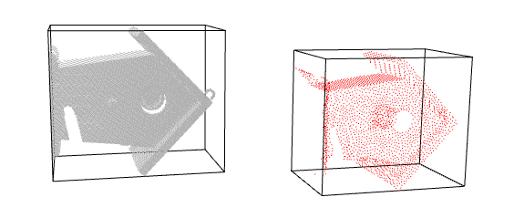
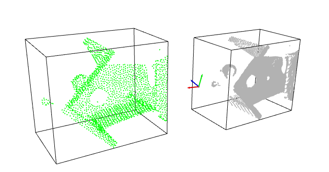
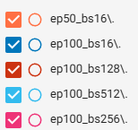
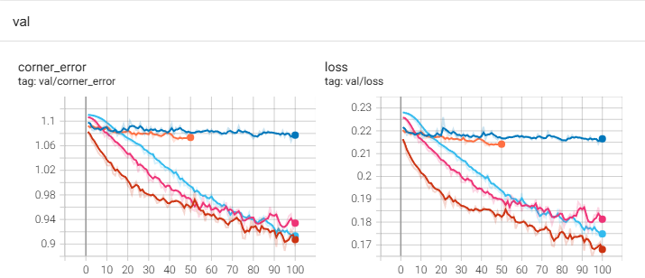

# 3D Bounding Box Prediction Pipeline

This repository contains an end-to-end deep learning pipeline for 3D bounding box prediction from RGB images, organized point clouds, instance segmentation masks, and ground-truth 3D boxes.

The pipeline includes:

- preprocessing
- data loading
- model training
- validation
- test-time inference
- qualitative visualization

The approach is object-centered: each object is first extracted from the scene using its instance mask, and the model predicts one 3D bounding box per extracted object.

---

## 1. Project Structure

```text
Sereact_assignment/
│
├── configs/
│   └── config.yaml
│
├── data/
│   ├── data_loader.py
│   └── data_utils.py
│
├── model/
│   └── custom_model.py
│
├── train/
│   └── trainer.py
│
├── visualize/
│   ├── visualize_data.py
│   └── visualize_preprocessed_data.py
│
├── preprocess.py
├── train.py
├── test.py
└── README.md
```

---

## 2. Data Format

The dataset is organized by scene. Each scene folder must contain:

- `rgb.jpg`
- `pc.npy`
- `mask.npy`
- `bbox3d.npy`

Expected shapes:

- `rgb.jpg` → RGB image of shape `(H, W, 3)`
- `pc.npy` → organized point cloud of shape `(3, H, W)`
- `mask.npy` → instance masks of shape `(N, H, W)`
- `bbox3d.npy` → 3D bounding boxes of shape `(N, 8, 3)`

where `N` is the number of objects in the scene.

---

## 3. Environment Setup

Create and activate your environment, then install the required packages.

Example:

```bash
conda create -n my_env python=3.11
conda activate my_env
```
## Requirements

Install dependencies with:

```bash
pip install -r requirements.txt
```


---

## 4. Preprocessing

Preprocessing extracts one object point cloud per instance mask, removes invalid points, normalizes the object and target box, resizes each sample to a fixed number of points, and stores the results into compressed scene-level `.npz` files.

### Example: preprocess with XYZ only

```bash
python preprocess.py --data_path <path\to\the\data\folder> --output_path <your\path\...\preprocess_data> --input_dim 2048 --overwrite --normalization_mode unit_sphere
```

### Example: preprocess with XYZRGB

```bash
python preprocess.py --data_path <path\to\the\data\folder> --output_path <your\path\...\preprocess_data> --input_dim 2048 --use_rgb --overwrite --normalization_mode unit_sphere
```

### Example: preprocess with center-only normalization

```bash
python preprocess.py --data_path <path\to\the\data\folder> --output_path <your\path\...\preprocess_data> --input_dim 2048 --use_rgb --overwrite --normalization_mode center_only
```

### Preprocessing arguments

- `--data_path` : root folder containing raw scene folders
- `--output_path` : folder where preprocessed `.npz` files will be stored
- `--input_dim` : number of points per object sample
- `--use_rgb` : store RGB together with XYZ
- `--overwrite` : overwrite existing preprocessed files
- `--normalization_mode` : `unit_sphere` or `center_only`
  
 



---

## 5. Training

Training is controlled through a YAML config file.

### Example training command

```bash
python train.py --config_path .\configs\config.yaml
```

### Important config fields

```yaml
experiment_name: "exp_name"

data:
  data_path: "path\to\the\data\folder"
  batch_size: 128
  num_workers: 4
  train_ratio: 0.8
  val_ratio: 0.1
  test_ratio: 0.1
  seed: 42

model:
  input_channels: 3   # 3 for XYZ, 6 for XYZRGB
  dropout: 0.3

train:
  epochs: 100
  lr: 0.001
  weight_decay: 0.0001
  use_amp: false
  scheduler: ~
  checkpoint_dir: "./checkpoints/exp_name"
  center_loss_weight: 0.0
```

### Notes

- `input_channels: 3` uses only XYZ
- `input_channels: 6` uses XYZRGB
- if the preprocessed files already contain RGB, the dataloader automatically slices the first 3 or all 6 channels depending on this value
- checkpoints are saved in `checkpoint_dir`
- TensorBoard logs are saved under `./runs/<experiment_name>`

---

## 6. TensorBoard

To monitor training curves:

```bash
tensorboard --logdir .\runs
```

Or to compare selected runs:

```bash
tensorboard --logdir_spec "run1:.\runs\run1_A,run2:.\runs\run2_x"
```

 


---

## 7. Testing / Inference

The test script loads the best saved checkpoint, evaluates it on the test split, computes final metrics, and optionally visualizes predictions.

### Example test command

```bash
python test.py --config_path .\configs\config.yaml
```

### Specify checkpoint manually

```bash
python test.py --config_path .\configs\config.yaml --checkpoint_path .\checkpoints\exp_name\best.pt
```

### Disable visualization

```bash
python test.py --config_path .\configs\config.yaml --skip_visualization
```
### List of all available test scenes and objects per scene

```bash
python test.py --config_path .\configs\config.yaml --list_test_scenes
```

### Visualize only one scene

```bash
python test.py --config_path .\configs\config.yaml --scene_name scene_0007 --num_visualizations 5
```
---

## 8. Output of Testing

The test script reports metrics such as:

- normalized corner error
- world-space corner error
- normalized center error
- world-space center error

It can also visualize:

- object crop with predicted vs ground-truth box
- full scene point cloud with predicted vs ground-truth box

Color convention:

- **blue** = ground truth
- **red** = prediction

<div align="center">
  
  
</div>

<div align="center">
 

</div>

<div align="center">
 

</div>

<div align="center">
 

</div>
---

## 9. Future Extensions

Possible future improvements include:

- stronger point-cloud architectures
- richer loss combinations
- IoU-aware objectives
- data augmentation
- more structured box parameterization
